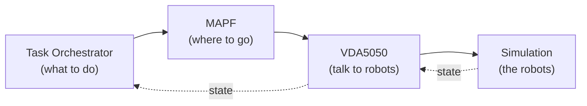

# Architecture

The demo is built from **four core modules**. Tasks flow _down_ into robot motion, and
robot state flows _back up_ to keep everyone in sync.



## The four modules

| Module                | Role                                                                        | Deep dive                                          |
| --------------------- | --------------------------------------------------------------------------- | -------------------------------------------------- |
| **Task Orchestrator** | Decides _what_ to do — runs the workflow for each task and requests routes. | [Task Orchestrator →](/modules/task-orchestrator/) |
| **MAPF**              | Decides _where to go_ — plans collision-free paths and drives execution.    | [MAPF →](/modules/mapf)                            |
| **VDA5050**           | Talks to the robots — relays commands and reports state back.               | [VDA5050 →](/modules/vda5050)                      |
| **Simulation**        | Plays the robot fleet so the whole stack runs without hardware.             | [Simulation →](/modules/simulation)                |

## End-to-end flow

1. A task is submitted.
2. The [**Task Orchestrator**](/modules/task-orchestrator/) runs the task's workflow and
   asks MAPF for routes.
3. [**MAPF**](/modules/mapf) plans collision-free paths and drives their execution.
4. [**VDA5050**](/modules/vda5050) relays the movement commands to the robots and reports
   their state back up the chain.
5. The [**Simulation**](/modules/simulation) plays the role of the robot fleet, closing
   the loop for monitoring and the next planning cycle.

## Repository layout

```
ros_industrial_ws/
├── ros_industrial_demo/      # integration hub: launch/teardown
├── ros_industrial_demo_docs/ # ← this documentation site (VitePress)
├── task_orchestrator_repo/   # Task Orchestrator
├── mapf_unified_repo/        # MAPF
├── vda5050_fiware_repo/      # VDA5050 bridge
└── simulation/               # UE5 packaged binary
```

To bring everything up, see [Getting Started](/guide/getting-started)
